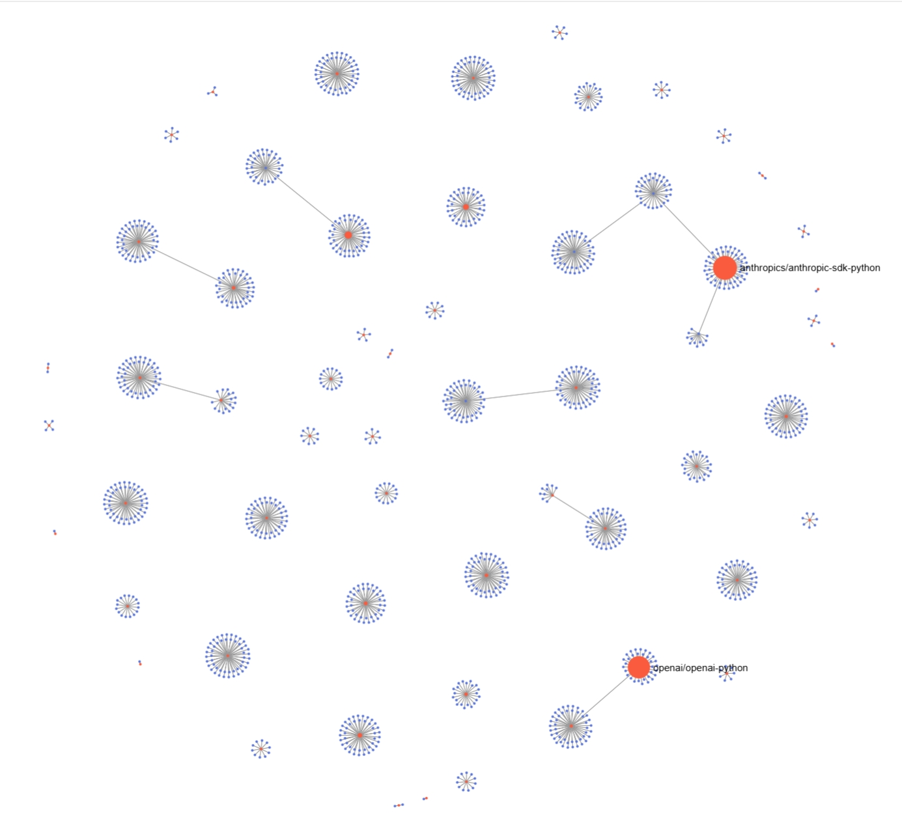

We categorize the collected LLM-based applications into two main types: framework-based and API-oriented. Below is a summary of the distribution.

# GitHub Repository Dependency Graph

For the collected GitHub repository dependency graph, please visit https://felinevolant.netlify.app/.



## Statistics

**API-oriented LLM Applications:**
The following table shows the number of projects and their dependencies for different programming languages using various LLM APIs:

| Language   | OpenAI   |            | Claude   |            | Gemini   |            | Qwen     |            |
| ---------- |----------|------------|----------|------------|----------|------------|----------|------------|
|            | Projects | Dependents | Projects | Dependents | Projects | Dependents | Projects | Dependents |
| Python     | 1481     | 28019      | 212      | 6223       | 272      | 2105       | 39       | 70         |
| Java       | 194      | 616        | 4        | 316        | 24       | 324        | 5        | 3          |
| JavaScript | 774      | 171        | 59       | 23         | 54       | 8          | 1        | 0          |

**Framework-based LLM Applications:**

| Framework        |   Quantity |
|------------------|-----------:|
| Autogen          |         61 |
| Mem0             |        430 |
| Haystack         |       2694 |
| Semantic Kernel  |        448 |
| Llama_Index      |        164 |
| LangChain        |      26085 |
| **Total**        |  **29882** |

# Usage

API-based data collection.

```graphql
└─api_repo # Output directory
    ├─c1_2_c2_dependents_filtered
    │  ├─repo_with_kw_claude_javascript_filtered_dele # Repositories with "Claude" keyword (JavaScript)
    │  ├─repo_with_kw_claude_java_filtered_dele
    │  ├─repo_with_kw_claude_python_filtered_dele
    │  ├─repo_with_kw_gemini_javascript_filtered_dele
    │  ├─repo_with_kw_gemini_java_filtered_dele
    │  ├─repo_with_kw_gemini_python_filtered_dele
    │  ├─repo_with_kw_openai_c#_filtered_dele
    │  ├─repo_with_kw_openai_go_filtered_dele
    │  ├─repo_with_kw_openai_javascript_filtered_dele
    │  ├─repo_with_kw_openai_java_filtered_dele
    │  ├─repo_with_kw_openai_Kotlin_filtered_dele
    │  ├─repo_with_kw_openai_php_filtered_dele
    │  ├─repo_with_kw_openai_python_filtered_dele
    │  ├─repo_with_kw_qwen_javascript_filtered_dele
    │  ├─repo_with_kw_qwen_java_filtered_dele
    │  └─repo_with_kw_qwen_python_filtered_dele
    ├─c1_repo_owner_des_less   # Owners and repositories of category 1 
    └─c2_starover0_filtered    # Category 2 repositories over zero stars
```

## Configuration
Before using this tool, please ensure you have properly configured the following in `utils/config.json`:
- `llm_api_url`: LLM API endpoint URL
- `api_key`: API access key
- `tokens`: List of GitHub access tokens
- `user_agent`: User agent string

Syntax:

```bash
python main.py api [--framework <name> | --url <api-url>] <languages...>
```

Example:

```bash
python main.py api --framework "claude" PHP GO
```

```bash
python main.py api --url "api.anthropic.com" PHP GO
```

Framework-based data collection.

Syntax:

```bash
python main.py repo [--framework <name> | --manual <repo-path>]
```

Example:

```bash
python main.py repo --framework "autogen"
```

```bash
python main.py repo --manual "microsoft/autogen"
```
